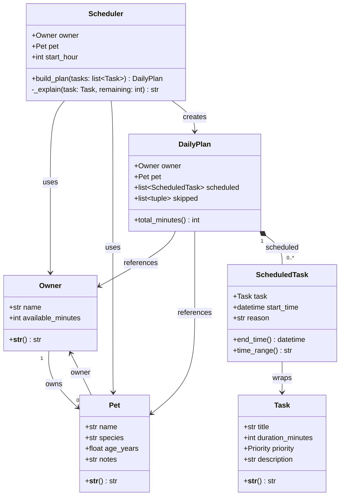

# PawPal+ UML Class Diagram

## Relationships

| Relationship | Type | Description |
|---|---|---|
| `Owner` → `Pet` | Association (1 to many) | An owner can have multiple pets |
| `Pet` → `Owner` | Association | Each pet belongs to one owner |
| `Scheduler` → `Owner` / `Pet` | Dependency | Scheduler uses these to build the plan |
| `Scheduler` → `DailyPlan` | Creation | `build_plan()` instantiates and returns a DailyPlan |
| `DailyPlan` ◆ `ScheduledTask` | Composition | ScheduledTasks only exist within a DailyPlan |
| `ScheduledTask` → `Task` | Association | Wraps a Task with a time slot and reason |
